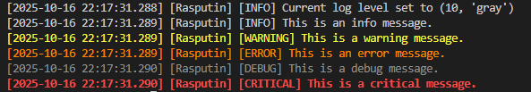

# 🧾 LuxForge Logger

Modular, multi-destination logging engine for branded audit overlays, CLI feedback, and external integrations. Fully configurable via `logger.env` or environment variables.

---

## ⚙️ Configuration Overview

Logger behavior is controlled via environment variables. You can define these in a locally accessible `logger.env` file or inject them dynamically.

### 🔧 General Settings

| Variable   | Description                                               | Default |
|------------|-----------------------------------------------------------|---------|
| `LOGLEVEL` | Global fallback log level if none are explicitly set      | `DEBUG` |

---

### 📁 Log Destinations

| Variable          | Description                                      | Default   |
|-------------------|--------------------------------------------------|-----------|
| `LOG_TO_FILE`     | Enable file logging                              | `True`    |
| `LOG_DIR`         | Directory for log files                          | `./Logs`  |
| `FILE_LOG_LEVEL`  | Log level for file output                        | *(inherits `LOGLEVEL`)* |

---

### 🖥️ Console Output

| Variable            | Description                                      | Default   |
|---------------------|--------------------------------------------------|-----------|
| `LOG_TO_CONSOLE`    | Enable console logging                          | `True`    |
| `CONSOLE_LOG_LEVEL` | Log level for console output                    | `DEBUG`   |

---

### 🌐 API Logging

| Variable         | Description                                      | Default |
|------------------|--------------------------------------------------|---------|
| `LOG_TO_API`     | Enable logging to external API                   | `False` |
| `API_ENDPOINT`   | Target URL for log submission                    | `None`  |
| `API_KEY`        | Authentication token for API                     | `None`  |
| `API_LOG_LEVEL`  | Log level for API output                         | `INFO`  |

---

### 🗄️ Database Logging

| Variable               | Description                                      | Default |
|------------------------|--------------------------------------------------|---------|
| `LOG_TO_DB`            | Enable logging to a database                     | `False` |
| `DB_CONNECTION_STRING` | Connection string for database target            | `None`  |

---

### 🧪 Log Formatting

| Variable                        | Description                                      | Default |
|----------------------------------|--------------------------------------------------|---------|
| `DATE_FORMAT`                   | Timestamp format                                | `%Y-%m-%d %H:%M:%S.%f` |
| `NUMBER_OF_DIGITS_AFTER_DECIMAL`| Precision for fractional seconds                | `3`     |
| `MAX_LOG_SIZE_MB`               | Max size per log file before rotation           | `5`     |
| `MAX_LOG_BACKUP_COUNT`          | Number of rotated log files to retain           | `5`     |

---

## 🧠 Usage

```python
from foundry.logger import logger

logger.debug("Debug message") # alias - logger.d
logger.info("Informational message") # alias - logger.i
logger.warning("Warning message") # alias - logger.w
logger.error("Error message") # alias - logger.e
logger.success("Custom success message")  # Optional extension
```

## Testing
Our logger comes with its own test. Simply initiate an instance of the logger and run 

```python
from foundry.logger import logger
logger.test_logger_levels()
```
Gives this result:\



## ENV File
For your convenience, here's a populated MD file with all the fields filled in
``` .env
## Logger Configuration

# ==========General Settings===========
# Log level (default: "DEBUG") -- if none of the others are set, this is the default
LOGLEVEL: DEBUG

# ==========Log Destinations===========
# Whether to log to a file (default: "True")
LOG_TO_FILE: True
# Directory to store log files (default: "./logs")
LOG_DIR: ./Logs
FILE_LOG_LEVEL: ""

# =========Console============
# Whether to log to console (default: "True")
LOG_TO_CONSOLE: True 
# Console log level (default: "DEBUG")
# CONSOLE_LOG_LEVEL: "DEBUG" 

# ==========API==============
# Whether to log to API endpoints (default: "False")
LOG_TO_API: False
# API endpoint URL (default: None)
API_ENDPOINT: None
# API key for authentication (default: None)
API_KEY: None
# API log level (default: "INFO")
# API_LOG_LEVEL: "INFO"

# ==========Database===========
# Whether to log to a database (default: "False")
LOG_TO_DB: False
# Database connection string (default: None)
DB_CONNECTION_STRING: None

# ==========Log Formatting===========
# Log message format (default: "[%(asctime)s] [%(levelname)s] %(message)s")
DATE_FORMAT: Date format for timestamps (default: "%Y-%m-%d %H:%M:%S.%f")
# Number of decimal digits in timestamps (default: 3)
NUMBER_OF_DIGITS_AFTER_DECIMAL: 3
# Maximum length of log messages (default: None, meaning no limit)
MAX_LOG_SIZE_MB: 5
# Maximum number of backup log files to keep (default: 5)
MAX_LOG_BACKUP_COUNT: 5
```